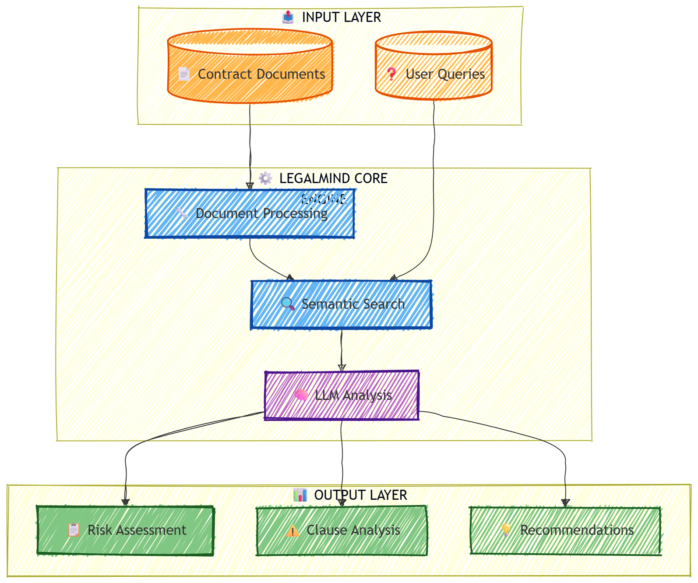
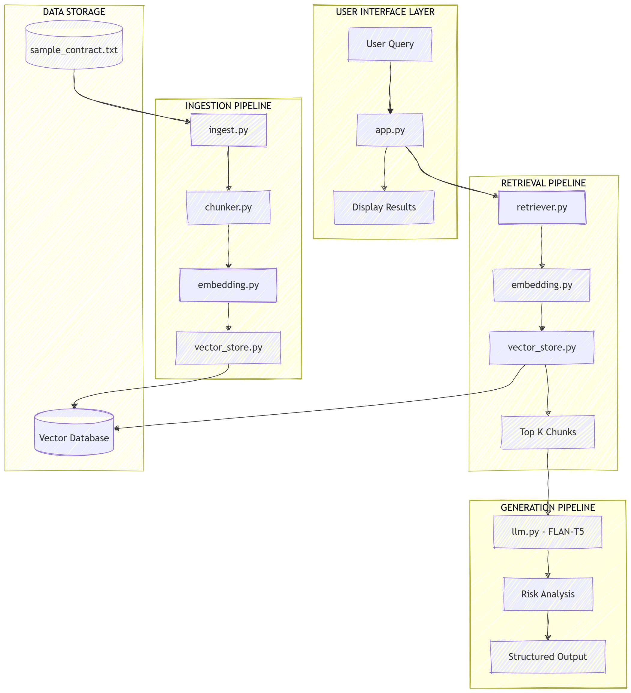
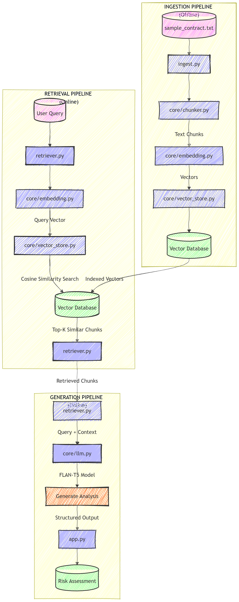
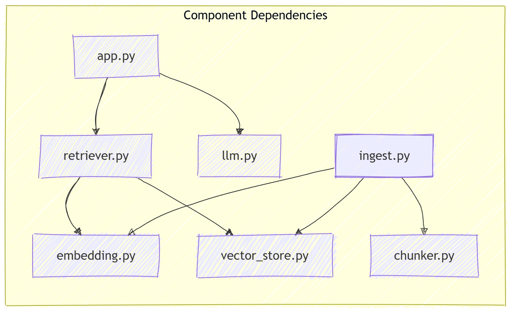
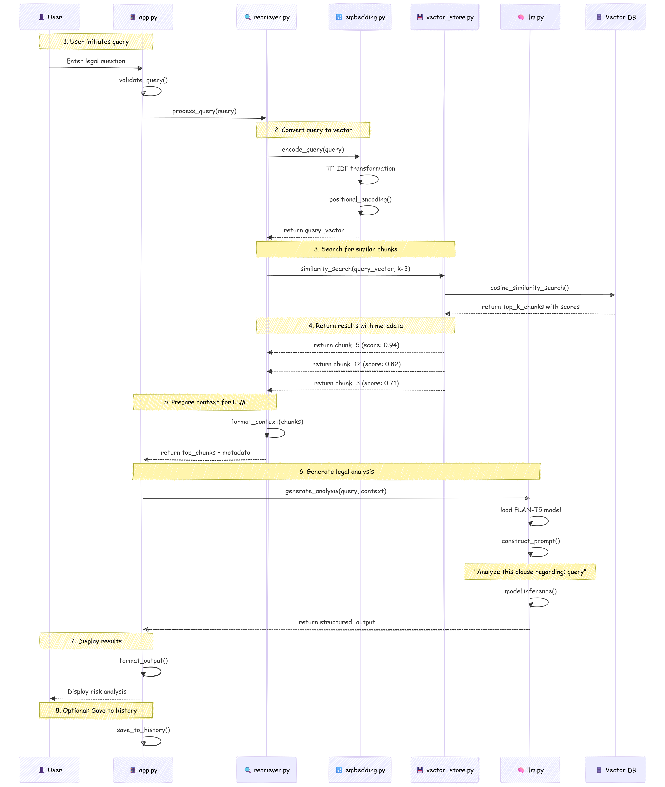

# ⚖️ LegalMind - Intelligent Legal Document Analysis System

[](https://www.python.org/)
[](LICENSE)
[](https://github.com/)
[](https://huggingface.co/google/flan-t5-base)

## 📋 Table of Contents
- [Overview](#-overview)
- [Key Features](#-key-features)
- [System Architecture](#-system-architecture)
- [Quick Start](#-quick-start)
- [Usage Guide](#-usage-guide)
- [Project Structure](#-project-structure)
- [Roadmap](#-roadmap)

## 📋 Overview

LegalMind is a sophisticated Retrieval-Augmented Generation (RAG) system designed specifically for legal document analysis. It combines the power of vector search with local LLM capabilities to provide intelligent, context-aware legal risk assessments from contract documents.

<div align="center">
  
  <br>
  <em>Figure 1: LegalMind System Overview</em>
</div>

### ✨ Key Features

- **Intelligent Document Processing**: Automatically chunks and processes legal documents
- **Semantic Search**: Finds relevant clauses using advanced embedding techniques
- **Local LLM Integration**: Uses FLAN-T5 for privacy-preserving legal analysis
- **Risk Assessment**: Provides structured risk analysis with explanations
- **Modular Architecture**: Easily extensible and maintainable codebase

## 🏗️ System Architecture

<div align="center">
  
  <br>
  <em>Figure 2: Complete RAG System Architecture</em>
</div>

### High-Level Architecture

The system consists of three main pipelines:

1. **Ingestion Pipeline** (Offline): Processes and indexes legal documents
2. **Retrieval Pipeline**: Finds relevant clauses based on user queries
3. **Generation Pipeline**: Generates risk analysis using LLM

<div align="center">
  
  <br>
  <em>Figure 3: Data Flow Through Pipelines</em>
</div>

### Component Details

<div align="center">
  
  <br>
  <em>Figure 4: Component Interaction Matrix</em>
</div>

## 🔄 Data Flow Sequence

<div align="center">
  
  <br>
  <em>Figure 5: Detailed Sequence Diagram</em>
</div>

## 🚀 Quick Start

### Prerequisites

- Python 3.8 or higher
- pip package manager
- Git (optional)

### Installation

1. **Clone the repository**
```bash
git clone https://github.com/Vivek-Vardhan-Reddy/LegalMind.git
cd legalmind
